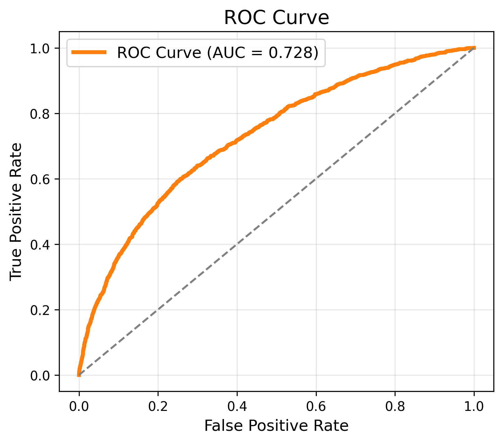
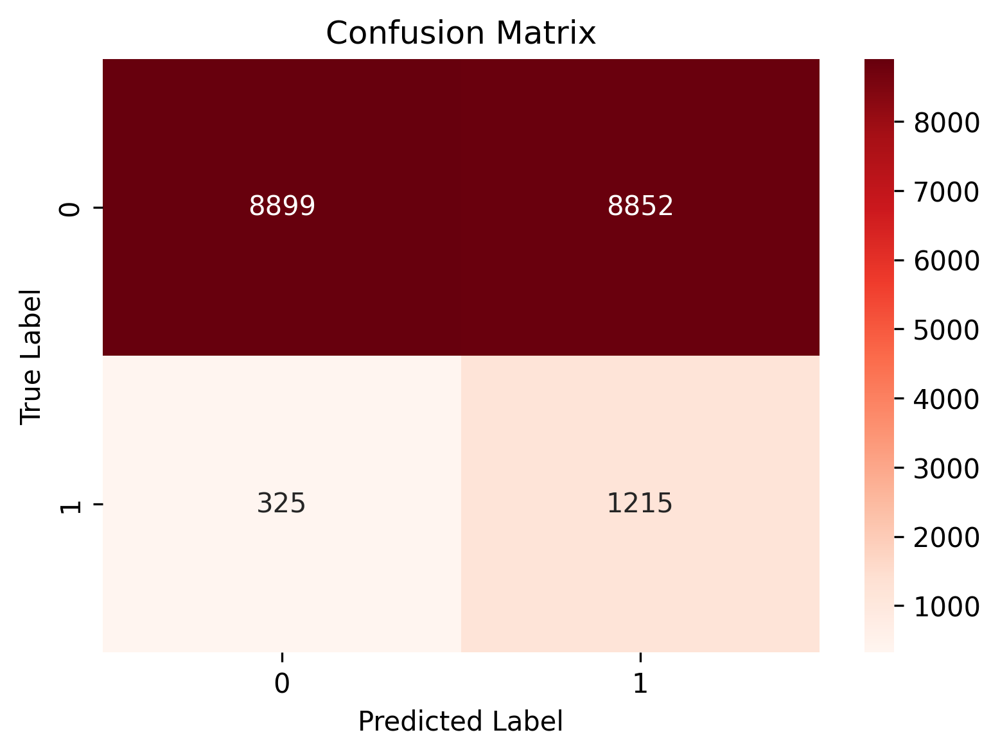

# Brazilian E-Commerce Delivery Delay Prediction (Classification)

This project is part of the **Multi-Table-ML-Pipeline** and focuses on a **classification task** using a real-world Brazilian e-commerce dataset.  
The goal is to predict whether an order will be **delayed** based on information from multiple related tables.

---

## 📌 Project Overview

- **Task Type**: Binary Classification  
- **Target Variable**: `is_delayed`  
- **Domain**: E-commerce logistics & delivery performance  
- **Dataset**: Brazilian E-Commerce (multi-table relational structure)

The project demonstrates how to:
- Integrate multiple relational tables
- Perform feature engineering on time, price, and customer attributes
- Train and evaluate classification models with imbalanced data
- Tune decision thresholds based on business needs

---

## 🧠 Models Used

- Logistic Regression  
- Random Forest Classifier  

Evaluation metrics include:
- Precision / Recall / F1-score  
- ROC Curve & AUC  
- Confusion Matrix  

---

## 📊 Results Visualization

### ROC Curve

### Confusion Matrix

---

## 📁 Project Structure
Brazilian_E-Commerce/
├── datasets/ # Raw and processed datasets
├── images/ # Saved figures (ROC, Confusion Matrix, etc.)
├── Brazilian_E-Commerce.ipynb
└── README.md

---

## 🛠 Tech Stack

- Python  
- Pandas / NumPy  
- Scikit-learn  
- Matplotlib / Seaborn  

---

## © Copyright

© 2026 **Mutian He**. All rights reserved.

